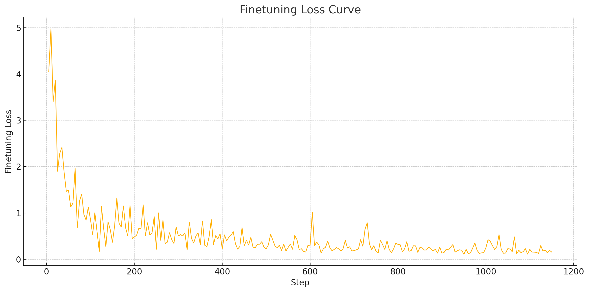

# LLM‑CUAD‑EVAL

Fine‑tune and evaluate **large‑language models (LLMs)** on the **CUAD – Contract Understanding Atticus Dataset**.  
The project focuses on **Llama 3.2 (3B parameters)** but the intention is to evaluate more models(open as well as paid) in the future.

---

## 📦 Repository layout

| Path / file                              | What it is                                                       |
| ---------------------------------------- | ---------------------------------------------------------------- |
| `finetune.py`                            | End‑to‑end fine‑tuning script (LoRA + 4‑bit) for 10 k CUAD train examples |
| `evaluate.py`                            | Exact‑Match / F1 scorer for **original vs. fine‑tuned** checkpoints |
| `finetune_evaluate_colab.ipynb`          | Colab Pro notebook that reproduces both scripts on an A100 40 GB |
| `get_claude_answers.py`                  | Script for evaluating Claude models(not completed) |
| `requirements.txt`                       | All Python dependencies |
| `assets/finetune_loss_curve.png`         |  PNG of training loss curve |
| `LICENSE`                                | MIT license |

---

## 🔧 Requirements

All dependencies are gathered in **`requirements.txt`** – they are the exact versions the scripts were developed with.  
*Key libraries:* `PyTorch`, `transformers`, `datasets`, `unsloth`, `bitsandbytes`, `accelerate`.

---

## 🚀 Quick start

> **Tip:** Use Python 3.9 / 3.10 and a GPU with ≥ 40 GB VRAM for training.  
> Evaluation will also run on smaller GPUs or CPU (slow).

```bash
# clone & enter
git clone https://github.com/<your‑user>/llm-cuad-eval.git
cd llm-cuad-eval

# optional – create a clean venv
python -m venv .venv && source .venv/bin/activate

# install everything
pip install -r requirements.txt
````

### 1. Fine‑tune Llama 3 3B on CUAD

```bash
python finetune.py
```

*The script handles:*

* downloading `unsloth/Llama-3.2-3B-Instruct-bnb-4bit`
* downloading **10 000** train examples from CUAD
  (the code fetches the dataset automatically – no manual download)
* training a 65 k‑token LoRA adapter
  (\~ 780 min on a single NVIDIA A100 40 GB)
* LoRA (0.81 % of weights trainable) + 4-bit quantization
* Trains **1 250 steps** (batch size 2 × grad\_accum 4 = 8 effective)

Outputs are written to `./cuad_finetuned_llama3_2_3b/`.

### 2. Evaluate

```bash
python evaluate.py \
  --model_path unsloth/Llama-3.2-3B-Instruct-bnb-4bit \
  --finetuned_model_path ./cuad_finetuned_llama3_2_3b \
  --split test
```

By default the script scores **both** checkpoints on the full CUAD test set (4 182 samples).
See `--help` for all CLI flags (sequence length, output dir, etc.).

### 3. (Optional) run everything on Colab

1. Open **`finetune_evaluate_colab.ipynb`** in Google Colab Pro/Pro+
2. Select **GPU → A100 (40 GB)**
3. Run all cells – that’s it.

---

## 📊 Results

| Model (3B)                                          | Exact Match |      F1 | Samples | Time (min) | Speed (sps) |
| --------------------------------------------------- | ----------: | ------: | ------: | ---------: | ----------: |
| *Original* `unsloth/Llama-3.2-3B-Instruct-bnb-4bit` | **27.14 %** | 32.24 % |   4 182 |     167.00 |        0.42 |
| *Fine‑tuned* `./cuad_finetuned_llama3_2_3b`         | **74.06 %** | 75.95 % |   4 182 |      60.15 |        1.16 |

**Δ Improvement**

* Exact‑Match: **+46.92 pp**
* F1: **+43.71 pp**

---

## 🔍 Qualitative examples (before → after)

<details>
<summary>Click to expand</summary>

```jsonc
// BEFORE FINETUNING
{
  "id": "LohaCompanyltd_20191209_F-1_EX-10.16_11917878_EX-10.16_Supply Agreement__Document Name",
  "question": "Highlight the parts (if any) of this contract related to \"Document Name\" that should be reviewed by a lawyer. Details: The name of the contract",
  "context_length": 11475,
  "ground_truths": [
    "SUPPLY CONTRACT"
  ],
  "prediction": "Contract Name: 12. Documents",
  "exact_match": 0,
  "f1_score": 0.3333333333333333
},
{
  "id": "LohaCompanyltd_20191209_F-1_EX-10.16_11917878_EX-10.16_Supply Agreement__Parties",
  "question": "Highlight the parts (if any) of this contract related to \"Parties\" that should be reviewed by a lawyer. Details: The two or more parties who signed the contract",
  "context_length": 11475,
  "ground_truths": [
    "The seller:"
  ],
  "prediction": "All of contract.",
  "exact_match": 0,
  "f1_score": 0.0
},
{
  "id": "LohaCompanyltd_20191209_F-1_EX-10.16_11917878_EX-10.16_Supply Agreement__Agreement Date",
  "question": "Highlight the parts (if any) of this contract related to \"Agreement Date\" that should be reviewed by a lawyer. Details: The date of the contract",
  "context_length": 11475,
  "ground_truths": [
    "Not found"
  ],
  "prediction": "The buyer entrust the entrusted party to purchase the products specified in this agreement from the seller in the form of orders.",
  "exact_match": 0,
  "f1_score": 0.0
}

// AFTER FINETUNING
{
  "id": "LohaCompanyltd_20191209_F-1_EX-10.16_11917878_EX-10.16_Supply Agreement__Document Name",
  "question": "Highlight the parts (if any) of this contract related to \"Document Name\" that should be reviewed by a lawyer. Details: The name of the contract",
  "context_length": 11475,
  "ground_truths": [
    "SUPPLY CONTRACT"
  ],
  "prediction": "SUPPLY CONTRACT",
  "exact_match": 1,
  "f1_score": 1.0
},
{
  "id": "LohaCompanyltd_20191209_F-1_EX-10.16_11917878_EX-10.16_Supply Agreement__Parties",
  "question": "Highlight the parts (if any) of this contract related to \"Parties\" that should be reviewed by a lawyer. Details: The two or more parties who signed the contract",
  "context_length": 11475,
  "ground_truths": [
    "The seller:"
  ],
  "prediction": "Seller",
  "exact_match": 1,
  "f1_score": 1.0
},
{
  "id": "LohaCompanyltd_20191209_F-1_EX-10.16_11917878_EX-10.16_Supply Agreement__Agreement Date",
  "question": "Highlight the parts (if any) of this contract related to \"Agreement Date\" that should be reviewed by a lawyer. Details: The date of the contract",
  "context_length": 11475,
  "ground_truths": [
    "Not found"
  ],
  "prediction": "Not found",
  "exact_match": 1,
  "f1_score": 1.0
}

// Claude Haiku 3
{
  "LohaCompanyltd_20191209_F-1_EX-10.16_11917878_EX-10.16_Supply Agreement__Document Name": "The following phrases from the contract relate to \"Document Name\" that should be reviewed by a lawyer:\n\n\"12.1 (1) Invoice in 5 originals indicating contract number and Shipping Mark (in case of more than one shipping mark, the invoice shall be issued separately).\"\n\n\"12",
  "LohaCompanyltd_20191209_F-1_EX-10.16_11917878_EX-10.16_Supply Agreement__Parties": "The relevant parts related to the \"Parties\" that should be reviewed by a lawyer are:\n\n1.1 \"This is a framework agreement, the terms and conditions are applied to all purchase orders which signed by this agreement (hereinafter referred to as the \"order\").\"\n\n2.1 \"",
  "LohaCompanyltd_20191209_F-1_EX-10.16_11917878_EX-10.16_Supply Agreement__Agreement Date": "The following phrases from the contract are related to the agreement date and should be reviewed by a lawyer:\n\n\"The Contract is concluded and signed by the Buyer and Seller on , in Hong Kong.\"\n\n\"This Contract is valid for 5 years, beginning from and ended on .\""
}
```


</details>

---

## 📈 Training curve



---

## 🤝 Acknowledgements

* **CUAD** – the Contract Understanding Atticus Dataset
* **Unsloth** – fast parameter‑efficient fine‑tuning library
* **Hugging Face ecosystem** – `transformers`, `datasets`, `peft`, etc.

---

## 📜 License

Released under the MIT License – see [`LICENSE`](LICENSE) for details.

